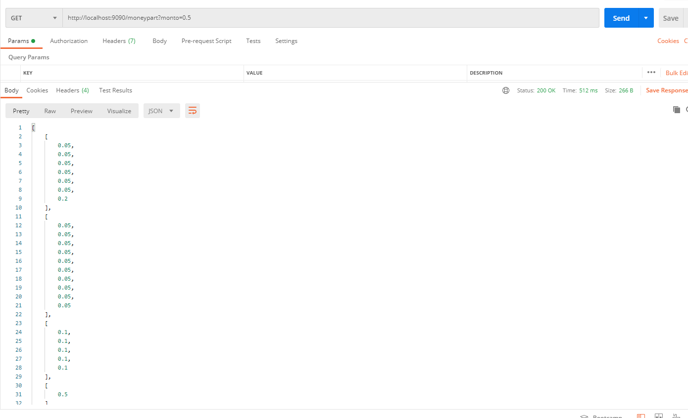
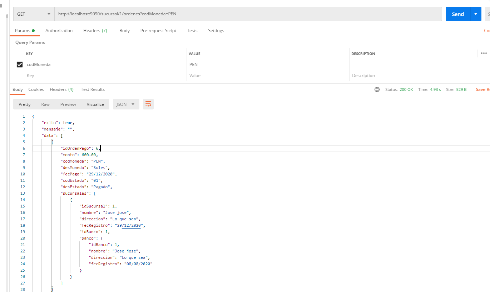
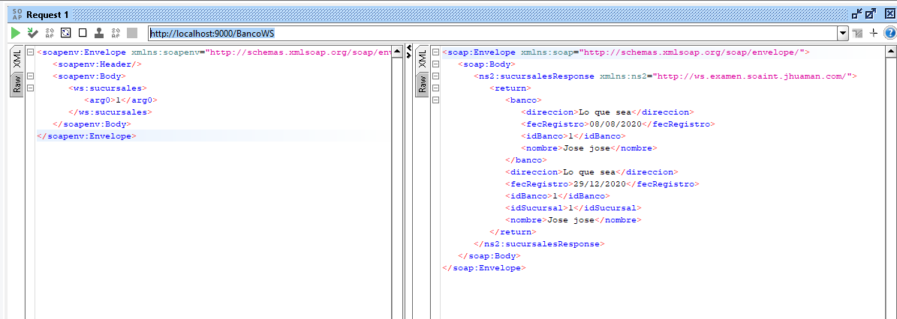

# soaintexamen

Repositorio de examen para soaint

## Instalación

Usar maven versión de 3 para adelante

Para levantar el servidor ejecutar lo siguiente:

```bash
mvn clean install
mvn -Pserver
```

## Script de Base de datos

Ejecutar script en servidor de Mysql

```
src/main/resources/script.sql
```

## MoneyParts

El java se encuentra en la ruta:

```
com.jhuaman.soaint.examen.ejercicio.MoneyParts
```

Como también se agrego un servicio para la prueba:

```
http://localhost:9090/moneypart?monto={monto} - GET
```



## CRUD DE CADA ELEMENTO

##### Servicios Bancos

```
http://localhost:9090/banco - GET
http://localhost:9090/banco/{idBanco} - GET
```

```
http://localhost:9090/banco - POST
BODY:
{
    "nombre": "Prueba Banco",
    "direccion": "Direccion del Banco"
}
```

```
http://localhost:9090/banco/{idBanco} - PUT
BODY:
{
    "nombre": "Prueba Banco",
    "direccion": "Direccion del Banco"
}
```

##### Servicios Sucursal

```
http://localhost:9090/sucursal - GET
http://localhost:9090/sucursal/{idSucursal} - GET
```

```
http://localhost:9090/sucursal - POST
BODY:
{
    "nombre": "Prueba Sucursal",
    "direccion": "Direccion del Sucursal"
}
```

```
http://localhost:9090/sucursal/{idSucursal} - PUT
BODY:
{
    "nombre": "Prueba Sucursal",
    "direccion": "Direccion del Sucursal"
}
```

##### Servicios Orden Pago

```
http://localhost:9090/ordenpago - GET
http://localhost:9090/ordenpago/{idOrdenPago} - GET
```


```
http://localhost:9090/ordenpago - POST
BODY:
{
    "monto": 400,
    "codMoneda": "PEN",
    "codEstado": "01",
    "sucursales": [
        {
            "idSucursal": 1
        }
    ]
}
```

```
http://localhost:9090/ordenpago/{idOrdenPago} - PUT
BODY:
{
    "monto": 400,
    "codMoneda": "PEN",
    "codEstado": "01",
    "sucursales": [
        {
            "idSucursal": 1
        }
    ]
}
```


## LISTAR ORDENES DE SUCURSAL CONSIDERAR FILTRO DE MONEDA

```
http://localhost:9090/sucursal/{idSucursal}/ordenes?codMoneda={codMoneda} - GET
```



## LISTAR SURCUSALES POR BANCO


```
http://localhost:9000/BancoWS
```



